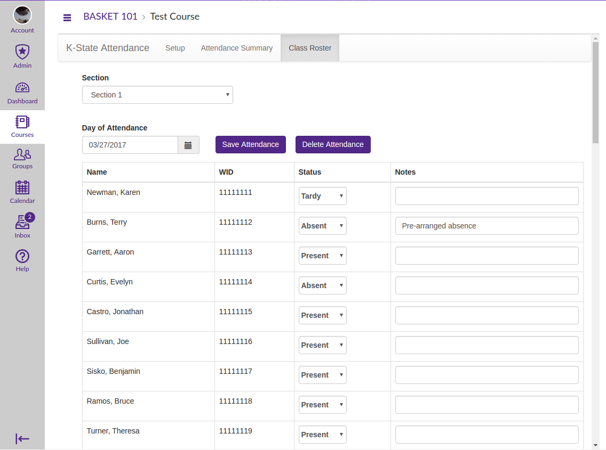
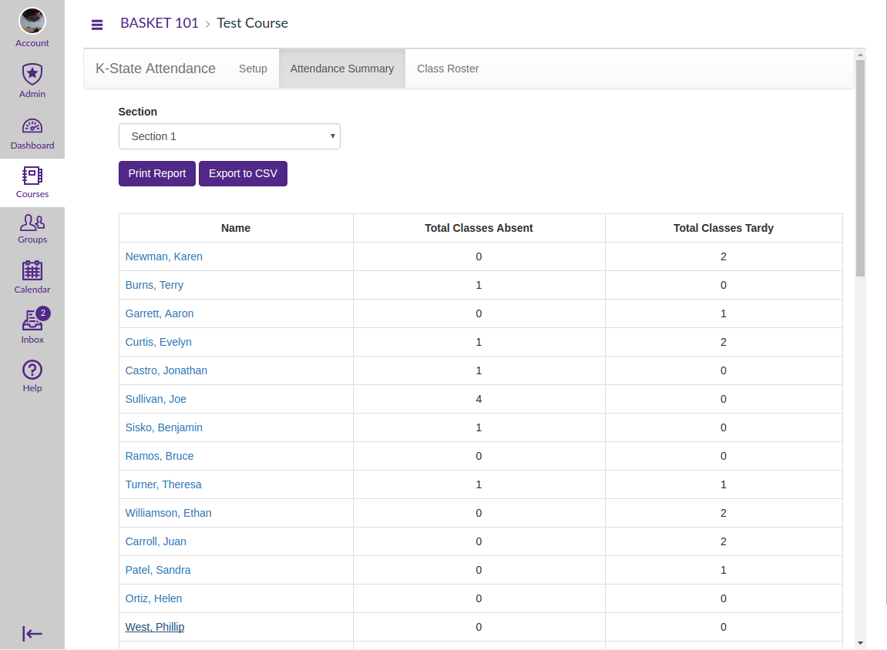
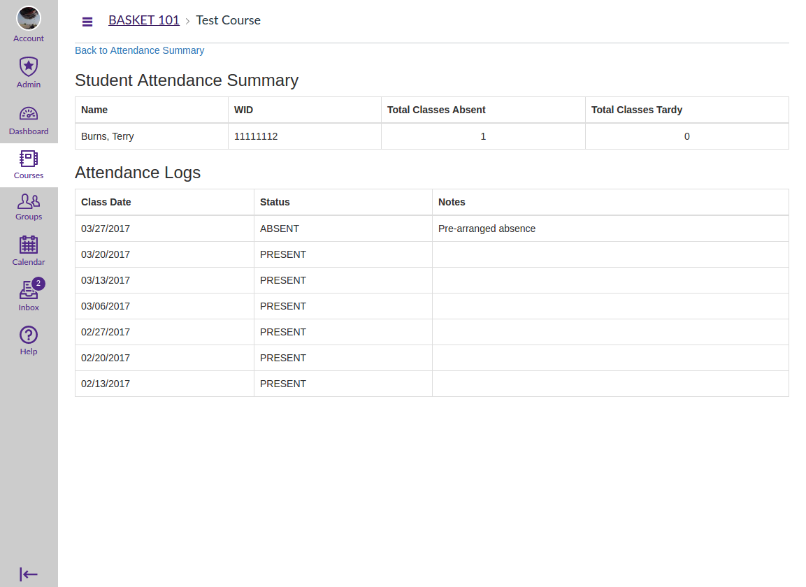

LTI Attendance Tool
==========
This is an LTI application that assists instructors in keeping attendance records for Canvas courses. 

It was originally developed for the K-State Polytechnic Campus in Salina for use in aviation related courses. The FAA has some very strict attendance requirements for some classes. Contact time between instructors and students must be tracked down to the minute with some make-up time allowed, also tracked in minutes. This application provides a convenient place in Canvas to track contact time.

The FAA required minutely reporting feature is optional. If it is disabled, the application only tracks daily attendance and doesn't deal with make up time.

Technologies Used in this project
------------
- Spring MVC 4
- Maven 3.1.1
- Arquillian 1.11.11
- Java 8
- Wildfly 8
- Oracle Database

External Resources
------------
### Web Services
This application talks to the Canvas API using the [Canvas API Library for Java](https://github.com/kstateome/canvas-api) and must be able to communicate with your Canvas instance (in the Amazon Cloud if hosted by Instructure) on port 443. 

### Database
This application needs a database to store its information in. It was written to talk to an Oracle database. Making the persistence layer database agnostic Is a future goal. A data source must be supplied to the application via the Wildfly config. For details on how to configure this, see the [INSTALL.md](INSTALL.md) file.

Application Set Up
------------
Once this application is running, an LTI link has to be installed in Canvas to make it accessible to users. See the [INSTALL.md](INSTALL.md) file for more details on how to set up and install this application.

Screenshots
------------
Here are some screen shots of the application running inside of a Canvas instance.

The screen where attendance is recorded:  

Class summary screen:  

Student Detail screen:  

K-State Info
------------
For K-State specific information that is usually in our project README files, look at [README_KSU.md](README_KSU.md).